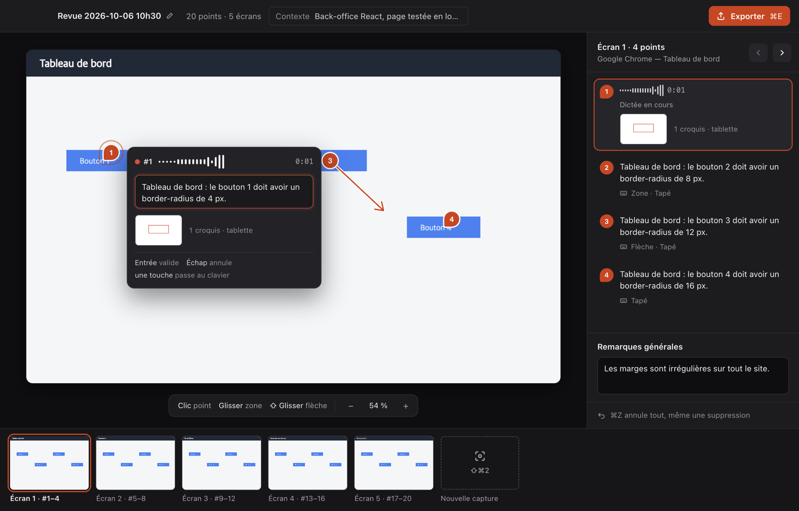

# VibeScreener

Revue d'interface par captures annotées, dictée et croquis, exportée pour l'IA. Un raccourci fige l'écran, un clic pose un point numéroté et lance la dictée, une tablette ajoute un croquis, puis on exporte en PDF, en Markdown ou en PowerPoint, ou Claude Code lit la revue directement.



## Installer

Sur un Mac Apple Silicon (M1 ou plus récent, macOS 13 ou plus), dans le Terminal :

```bash
curl -fsSL https://raw.githubusercontent.com/gfavier-marie/vibescreener/main/install.sh | sh
```

La commande installe VibeScreener dans Applications, la branche à Claude Code s'il est installé, puis la lance. Elle sert aussi aux mises à jour.

<details>
<summary>Sans Terminal : le .dmg</summary>

Télécharger [VibeScreener-arm64.dmg](https://github.com/gfavier-marie/vibescreener/releases/latest/download/VibeScreener-arm64.dmg) et glisser VibeScreener dans Applications. L'app n'étant pas signée par Apple, la première ouverture est bloquée : Réglages Système > Confidentialité et sécurité > « Ouvrir quand même ».
</details>

Sur un PC Windows 10 ou 11 (64 bits), dans PowerShell (menu Démarrer > « PowerShell ») :

```powershell
irm https://raw.githubusercontent.com/gfavier-marie/vibescreener/main/install.ps1 | iex
```

Même rôle que sur Mac, sans droits administrateur : l'app s'installe pour l'utilisateur et vit dans la zone de notification (en bas à droite).

<details>
<summary>Sans PowerShell : le .exe</summary>

Télécharger [VibeScreener-Setup.exe](https://github.com/gfavier-marie/vibescreener/releases/latest/download/VibeScreener-Setup.exe) et l'ouvrir. L'installeur n'étant pas signé, Windows affiche « Windows a protégé votre ordinateur » : « Informations complémentaires » > « Exécuter quand même ».
</details>

## Premier lancement

VibeScreener vit dans la barre de menus (zone de notification sous Windows). Un assistant en trois étapes :

1. **Autorisations** : enregistrement de l'écran (Mac seulement, puis relancer VibeScreener) et micro.
2. **Modèle de dictée** : téléchargé tout seul (547 Mo, une seule fois). La dictée se fait ensuite sur l'ordinateur, hors ligne.
3. **Raccourci** : **⇧⌘2** (Windows : **Ctrl+Shift+2**) fige l'écran ; clic sur l'élément, on parle, c'est noté. **⌘E** (**Ctrl+E**) exporte.

## Inspiration

Pour montrer à quoi un point doit ressembler : dans la bulle du point, **Inspiration**. L'éditeur s'efface ; ouvrir la page modèle (un autre site, une autre app), puis **⇧⌘2** et cliquer la fenêtre ou glisser une zone. L'image rejoint le point, l'éditeur revient dessus (Échap : retour sans rien joindre). Une image peut aussi être collée (**⌘V**) ou déposée sur le point sélectionné. Les exports et Claude Code la présentent comme un modèle, pas comme l'écran à modifier.

## Tablette (iPad + Apple Pencil)

Menu de l'icône > « Appairer une tablette », scanner le QR code avec l'appareil photo de l'iPad, puis Partager > « Sur l'écran d'accueil ». Le croquis dessiné sur l'iPad rejoint le point en cours. Rien à installer d'autre, en Wi-Fi comme en 4G.

## Claude Code

L'installeur ajoute le serveur MCP de VibeScreener à Claude Code. Sinon, une fois (la commande est aussi dans les réglages, onglet « Export PDF ») :

```bash
claude mcp add --transport http --scope user vibescreener http://127.0.0.1:3917/mcp
```

VibeScreener doit être lancée. Il suffit ensuite de demander à Claude Code, dans le projet concerné, « applique la revue VibeScreener ». Trois outils, en lecture seule :

| Outil | Rôle |
| --- | --- |
| `lister_sessions` | Les 20 sessions récentes, avec leur id ; la session ouverte est signalée |
| `lire_revue` | Tous les retours d'une session en texte (la session ouverte par défaut) |
| `voir_ecran` | Un écran : capture annotée, zoom autour de chaque point, croquis, inspirations |

Port pris : les réglages le signalent ; `PASTILLE_MCP_PORT` en choisit un autre (à reporter dans la commande ci-dessus).

## Confidentialité

- Captures, sessions et dictée restent sur l'ordinateur (transcription locale par [whisper.cpp](https://github.com/ggml-org/whisper.cpp)). Le moteur par API, optionnel, envoie l'audio au service choisi.
- La tablette passe par un relais partagé (Cloudflare) qui ne voit que des messages chiffrés (AES-GCM) : la clé est dans le QR code et ne passe jamais par le serveur.
- Le serveur MCP n'écoute que sur `127.0.0.1` et refuse les requêtes venant d'un navigateur.

## Limites

- **Mac Apple Silicon et Windows 10/11 64 bits.** La version Windows est en test : installée et vérifiée automatiquement sur un Windows de GitHub (dictée, exports, capture), pas encore sur un vrai PC. Dictée plus lente sur PC que sur Mac (pas d'accélération GPU) ; sur un PC ARM, l'app tourne en émulation x64.
- **Installeur Windows non signé** : SmartScreen avertit si le .exe est téléchargé par le navigateur (la commande PowerShell l'évite).
- **Pas de signature Apple** : après chaque mise à jour, macOS redemande les autorisations écran et micro.
- Le relais de la tablette est un service gratuit, hébergé sans garantie ; on peut héberger le sien (voir plus bas).

## Développer

Prérequis : Node 22.18 ou plus récent, pnpm (`corepack enable`), git.

```bash
pnpm install
pnpm setup:whisper   # modèle Whisper + whisper-server (Mac : brew install whisper-cpp avant ; Windows : téléchargé)
pnpm dev             # lance l'app (depuis ton propre Terminal sur Mac, pour l'autorisation d'enregistrement d'écran)
```

| Commande | Rôle |
| --- | --- |
| `pnpm test`, `pnpm typecheck` | Tests unitaires et vérification des types |
| `pnpm e2e` | Session factice, dictée par un faux micro, photo de l'éditeur et des réglages, exports PDF, Markdown et PowerPoint, lecture d'un écran par le serveur MCP (`e2e-output/`) |
| `pnpm bench:dictee` | Temps de transcription de 5 s de français |
| `pnpm relay` | Relais + PWA de la tablette en local (http://localhost:8787), visé par `pnpm dev` |
| `pnpm bench:synchro [url]` | QR d'appairage et aller-retour chiffré desktop ↔ tablette |
| `pnpm build:whisper-mac` | whisper-server autonome (statique, Metal) pour l'installeur Mac ; nécessite cmake |
| `pnpm dist` | Installeur de la plateforme courante (`apps/desktop/dist/` ; Windows : `pnpm setup:whisper` avant, pour embarquer whisper-server) |

Le menu de l'icône garde une entrée « Mesures (POC) » pour remesurer la capture et la dictée.

### Publier une version

Monter la version dans `apps/desktop/package.json`, puis `git tag v0.2.0 && git push --tags` : la CI construit le .dmg et le .exe, installe et teste l'app sur Windows, puis crée la Release GitHub, que les installeurs et les apps installées prennent automatiquement. Sans tag, « Run workflow » avec « Construire les installeurs » fait tout sauf la Release (installeurs dans les artefacts du run).

### Héberger son propre relais

Le relais (Worker Cloudflare + Durable Object) sert aussi la PWA de croquis. Un compte Cloudflare gratuit suffit.

```bash
pnpm --filter @pastille/relay exec wrangler login
pnpm relay:deploy
```

Remplacer ensuite l'adresse du relais partagé dans `apps/desktop/src/main/index.ts` (`RELAY_URL`) avant `pnpm dist`, ou lancer `PASTILLE_RELAY=https://… pnpm dev`.

## Licence

[MIT](LICENSE)
